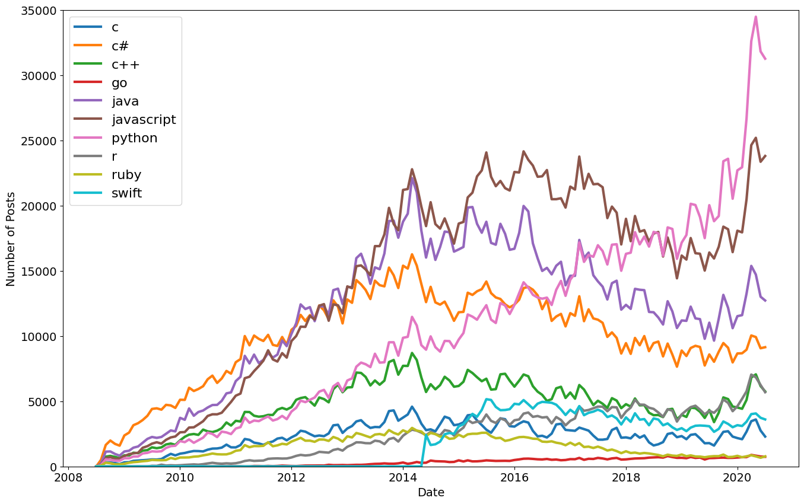

## Project 1: Lego themes

### Overview
In this project, I examined various Lego sets to gain insights into the most popular Lego themes.

#### Reference Data Resource
- Lego Sales Dataset: [Kaggle](link_to_dataset)

## Project 2: Popularity of Programming Languages

### Overview
In this project, I analyzed the popularity of different programming languages throughout history.

#### Reference Data Resource
- Programming Languages Dataset: [Kaggle](link_to_dataset)

## Project 3: Nobel Prize Winner by Countries

### Overview
In this project, I worked on a Nobel Prize analysis by countries, aiming to categorize the prize winners by country.

#### Reference Data Resource
- Nobel Prize Winners: [Kaggle](link_to_dataset)

## Tools Used
- Python for data acquisition, preparation, analytics, and visualization.
- Libraries: pandas, numpy, scikit-learn, matplotlib, seaborn.
